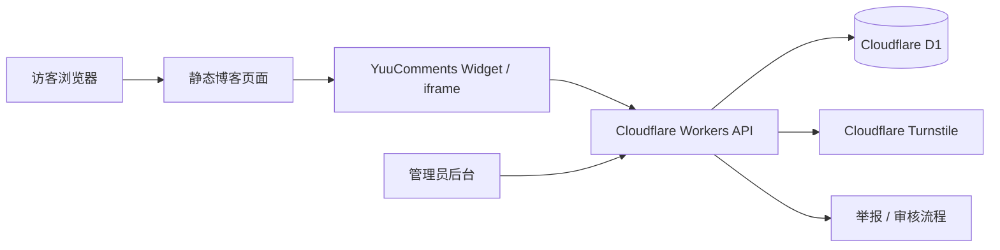

# YuuComments v0.1.4：给静态博客一个 Cloudflare-native 的评论系统

YuuComments 是一个面向静态博客的评论系统。

它的定位很简单：不自建服务器，不依赖 MongoDB / LeanCloud，不强制访客使用 GitHub 登录；后端运行在 Cloudflare Workers 上，评论数据存进 Cloudflare D1，前端以静态资源的形式接入到 Astro、Hexo、Hugo、VuePress 或普通 HTML 页面里。

v0.1.4 是一个偏实用的版本：它补上了评论举报流程，也加入了安全的 Markdown 评论和 LaTeX 数学公式渲染。换句话说，评论区开始更接近一个真实博客长期使用时需要的样子了。

## 为什么做 YuuComments

静态博客的好处是简单、快、维护成本低。页面可以直接放在 Cloudflare Pages、GitHub Pages、Vercel 或任意静态托管服务上。

但评论系统往往会把这种简单性打破：

- 使用 Giscus，需要依赖 GitHub Discussions，访客通常要有 GitHub 账号。
- 使用 Twikoo / Waline，体验很好，但通常需要额外的数据库或 serverless 配置。
- 自己写一个后端，又会重新回到服务器、数据库、部署和安全维护的问题里。

YuuComments 想走另一条路：把评论系统需要的后端能力尽量放进 Cloudflare 免费生态和边缘网络里。

它适合这样的博客：

- 站点本身是静态生成的。
- 不想维护一台长期运行的服务器。
- 不想把评论数据放到 GitHub Issues / Discussions 里。
- 希望评论数据留在自己的 Cloudflare 账号下。
- 希望访客可以匿名评论、点赞、回复和举报。

## v0.1.4 更新重点

这次版本主要包含两类更新。

第一类是内容展示能力：

- 支持安全的 Markdown 评论渲染。
- 支持基于 KaTeX 的 LaTeX 数学公式渲染。
- 后台也可以预览 Markdown 和公式渲染效果。
- 评论内容仍然以原始 Markdown 文本存储，不需要为了渲染额外改数据库结构。

第二类是审核和治理能力：

- 新增公开评论举报入口。
- 举报者需要填写邮箱。
- 后台新增举报管理视图。
- 管理员可以将举报标记为已处理或忽略。
- 管理员可以在举报视图里删除被举报评论。
- 评论被多次举报后，会自动回到待审核状态。

其中“多次举报后回到待审核”目前的默认阈值是 5 次。它不会自动删除评论，只是把已经通过的评论重新交给管理员确认，这样可以避免误伤。

## 整体原理

YuuComments 的架构可以拆成三层：

1. 博客页面里的评论组件或 iframe。
2. Cloudflare Workers API。
3. Cloudflare D1 数据库。

如果用图表示，大概是这样：



评论区本身是静态前端资源。它负责渲染评论列表、评论表单、回复按钮、点赞按钮和举报入口。

真正会改变数据的操作都会请求 Worker：

- 发表评论。
- 获取评论列表。
- 点赞或取消点赞。
- 举报评论。
- 管理员审核评论。
- 管理员处理举报。

Worker 再去读写 D1。这样博客页面不需要暴露数据库连接信息，也不需要自己运行 Node.js 服务。

Turnstile 则用于减少自动化垃圾评论。前端拿到 Turnstile token 后，在提交评论时交给 Worker，Worker 使用 `TURNSTILE_SECRET_KEY` 去 Cloudflare 校验，校验通过后才写入评论。

## v0.1.4 的 API 简介

YuuComments 的 API 目前保持得比较轻量。普通访客接口主要面向评论、点赞和举报，管理员接口则需要 `ADMIN_TOKEN` 授权。

常用公开接口：

| 方法 | 路径 | 说明 |
|---|---|---|
| `GET` | `/api/comments?pagePath=/posts/example/` | 获取某个页面的评论列表 |
| `POST` | `/api/comments` | 创建评论或回复 |
| `POST` | `/api/comments/:id/like` | 点赞评论 |
| `DELETE` | `/api/comments/:id/like` | 取消点赞 |
| `POST` | `/api/comments/:id/report` | 举报评论 |

v0.1.4 新增的举报请求体示例：

```json
{
  "email": "reporter@example.com",
  "reason": "spam",
  "message": "这里可以填写补充说明"
}
```

`reason` 当前支持这些值：

```text
spam
abuse
harassment
privacy
illegal
other
```

管理员相关接口：

| 方法 | 路径 | 说明 |
|---|---|---|
| `GET` | `/api/admin/comments` | 获取后台评论列表 |
| `PATCH` | `/api/admin/comments/:id/status` | 修改评论状态 |
| `DELETE` | `/api/admin/comments/:id` | 删除评论 |
| `GET` | `/api/admin/reports?status=open` | 获取举报列表 |
| `PATCH` | `/api/admin/reports/:id/status` | 修改举报状态 |

修改举报状态的请求体示例：

```json
{
  "status": "resolved"
}
```

举报状态可以是：

```text
open
resolved
ignored
```

管理员接口需要带上后台 Token。实际接入时可以直接使用内置管理后台，不需要手写这些请求。

## Markdown 和数学公式是怎么做的

v0.1.4 的 Markdown 和数学公式渲染是前端能力。

评论提交后，数据库里保存的仍然是用户输入的原始文本。展示时，前端会先对内容做安全处理，再把 Markdown 转成 HTML，并用 KaTeX 渲染公式。

这样做有几个好处：

- 不需要新增后端 migration。
- 老评论可以直接使用新的渲染能力。
- 如果以后需要调整渲染规则，不必批量改数据库内容。
- 原始 Markdown 仍然可保留，适合后续导出或迁移。

为了安全，评论中的原始 HTML 不会作为活动 HTML 执行；评论链接也会限制安全协议，并带上 `nofollow noopener noreferrer` 等属性。

如果你不想启用 Markdown 或公式，可以在嵌入时关闭：

```html
<div
  id="yuucomments"
  data-page-key="/posts/example/"
  data-markdown="false"
  data-math="false"
></div>
```

## 部署方法

YuuComments 的推荐部署方式是一条命令：

```bash
pnpm deploy:backend
```

这个命令会自动处理大部分后端部署流程，包括：

- 安装依赖。
- 检查 Cloudflare 登录状态。
- 创建或复用 Cloudflare D1 数据库。
- 配置 Turnstile。
- 上传 Worker secrets。
- 执行远程 D1 migrations。
- 部署 Cloudflare Worker。
- 生成前台评论组件和后台静态资源。

部署完成后，需要把生成出来的静态资源发布到你的站点中：

```text
dist/frontend/  -> /comments/
dist/admin/     -> /admin/
```

然后在博客文章页面里插入评论组件。

最小直嵌示例：

```html
<div
  id="yuucomments"
  data-page-key="/posts/example/"
  data-markdown="true"
  data-math="true"
></div>
<link rel="stylesheet" href="/comments/comments.css" />
<script src="/comments/yuucomments.config.js"></script>
<script src="/comments/comments.js" defer></script>
```

如果你的博客主题样式比较复杂，也可以使用 iframe 模式隔离评论区：

```html
<div
  id="yuucomments-iframe"
  data-page-key="/posts/example/"
  data-src="/comments/embed.html"
  data-theme="dark"
  data-lang="zh-CN"
  data-markdown="true"
  data-math="true"
></div>
<script src="/comments/yuucomments-embed.js" defer></script>
```

`data-page-key` 用来标识当前页面。一般可以使用文章路径，比如 `/posts/yuucomments-v0.1.4/`。同一个 `page-key` 下的评论会被归到同一篇文章。

## 从旧版本升级

如果是全新部署，直接使用当前版本的一键部署流程即可。

如果你已经部署过旧版本，并且要使用 v0.1.4 的举报功能，需要先执行新的 D1 migration：

```bash
pnpm db:migrate:remote
```

本地开发环境可以执行：

```bash
pnpm db:migrate:local
```

Markdown 评论和 LaTeX 公式渲染不需要额外数据库 migration，因为它们只影响前端展示。

## 安全提醒

部署时要特别注意几个密钥的边界：

- `PUBLIC_TURNSTILE_SITE_KEY` 是公开 Key，可以放在前端。
- `TURNSTILE_SECRET_KEY` 只能作为 Worker secret 保存。
- `ADMIN_TOKEN` 是后台管理凭证，正式环境不要公开。
- `CLOUDFLARE_API_TOKEN` 只用于部署，不要提交到仓库。

举报功能会保存举报者邮箱，并且管理员可以在后台看到。YuuComments 不会在 `comment_reports` 表里保存原始 IP 或原始 User-Agent，而是使用匿名 hash 做重复举报判断。

## 适合谁使用

YuuComments 目前仍然是早期项目，不适合把它当成大型社区系统使用。

但如果你有一个个人博客、技术博客或小型静态站，希望拥有一个轻量、可自管、不强制登录、尽量贴近 Cloudflare 生态的评论系统，那么 v0.1.4 已经可以覆盖比较核心的场景：

- 评论。
- 回复。
- 点赞。
- 举报。
- 后台审核。
- Markdown。
- 数学公式。
- iframe 嵌入。

后续版本会继续围绕可靠性、审核工作流、部署体验和主题定制推进。v1.0 之前，重点会放在邮件通知、导入导出、更好的反垃圾策略、更多框架示例以及稳定 API 和数据库结构上。

## 结语

YuuComments 的目标不是做一个“大而全”的评论平台，而是给静态博客提供一个足够轻、足够清楚、足够可控的评论系统。

静态博客已经可以很轻地发布内容，评论系统也应该尽量保持这种轻盈感。

v0.1.4 补上了举报、Markdown 和数学公式这些更接近日常使用的能力。它还很早期，但已经开始有一点“可以长期放在博客里用”的样子了。
